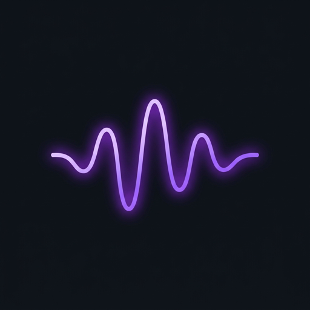
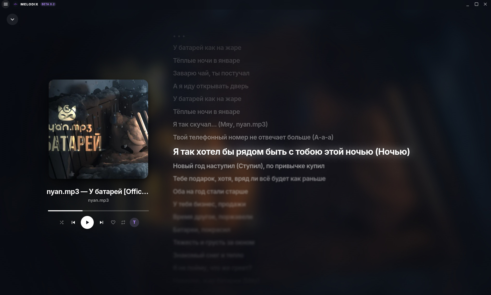

<p align="center">
  
</p>

<h1 align="center">Melodix (v1.0.0 Beta)</h1>

<p align="center">
  <b>Современный, сверхбыстрый и эстетичный кроссплатформенный музыкальный плеер нового поколения.</b><br/>
  Доступен для <b>Android</b>, <b>iOS</b>, <b>Linux</b>, <b>Windows</b> и <b>macOS</b>.<br/>
  Синхронизированные тексты песен, поиск по трекам, альбомам и исполнителям, динамический адаптивный фон и отзывчивый интерфейс Material 3 / Material You / Liquid Glass.
</p>

<p align="center">
  
  
  
  
  
  
  
</p>

<p align="center">
  
</p>

---

## ✨ Ключевые возможности

- 📱 **Кроссплатформенность нового уровня**:
  - **Android**: Нативный APK (включая Universal APK с поддержкой всех архитектур процессоров: arm64-v8a, armeabi-v7a, x86_64). Поддержка Material You стилизации под цвет системы и плавной навигации без синей подсветки нажатий.
  - **iOS**: Оптимизированная сборка с Liquid Glass эффектом размытия нижней панели, поддержкой Safe Area и плавными жестами.
  - **Desktop (Linux, Windows, macOS)**: Полноценное Electron-приложение с аппаратным ускорением, системным треем и горячими клавишами.

- 🎵 **Двухрежимный мобильный плеер**:
  - Мгновенное переключение между режимами по кнопке **«Т» (Lyrics)**:
    - **Режим обложки**: крупная обложка альбома высокого разрешения, название трека, автор и плавная строка прогресса.
    - **Режим текста**: полноэкранный синхронизированный текст песни с плавной прокруткой и подсветкой текущей строки.

- ❤️ **Избранное для треков, альбомов и артистов**:
  - **Вкладка «Треки»**: коллекция сохраненных треков с возможностью запустить всё в один клик.
  - **Вкладка «Альбомы»**: сетка любимых альбомов с быстрым переходом к треклисту и кнопкой воспроизведения.
  - **Вкладка «Исполнители»**: карточки любимых исполнителей с прямым переходом к полной дискографии.
  - Добавление в избранное в один клик из поиска, карточки альбома или со страницы артиста.

- 🔍 **Умный поиск треков, альбомов и исполнителей**:
  - Мгновенный поиск песен и официальных релизов.
  - Поддержка поиска по каналам и хэндлам (например, `@nyan.mp3` или `nyan.mp3`) с автоматическим извлечением вкладки релизов и видео.
  - Умная фильтрация: отсеивание разговорных видео, реакций, подкастов и обучающих видео.
  - Фильтр-вкладки в поиске: **Все**, **Треки**, **Альбомы**.

- 💿 **Интерактивный просмотр альбомов**:
  - Карточки альбомов с обложками высокого разрешения.
  - Окно альбома с полным треклистом, длительностью треков и общим временем звучания.
  - Кнопки **«Слушать всё»** (воспроизведение с 1-го трека с добавлением альбома в очередь) и **«В очередь»** (добавление треков в текущую очередь без прерывания песни).

- 🎤 **Интерактивные тексты песен (Lyrics)**:
  - Синхронизированный построчный текст (LRC) с плавной кинематографичной автопрокруткой и акцентной подсветкой активной строки.
  - Кликабельные строки текста для мгновенной перемотки к нужной фразе (с защитой от ложных переключений трека).
  - **Фоллбек для несинхронизированного текста**: если тайминги отсутствуют, плеер аккуратно отображает полный текст песни для комфортного чтения.

- ⏱ **Умный предпросмотр на ползунке трека**:
  - При наведении курсора на прогресс-бар (в мини-плеере и в полноэкранном режиме) отображается стильная плашка со временем под курсором и общей длительностью: `текущее / всего`.
  - Плавный Direct-DOM RAF-трекинг без лишних перерисовок интерфейса (стабильные 60+ FPS).

- 🎨 **Material 3 Expressive & Динамический фон**:
  - Живое размытие фона в такт обложке воспроизводимого трека (режимы: *Ambient*, *Vibrant*, *Glow*, *Acrylic*).
  - Адаптивные приветствия в зависимости от времени суток: **«Доброе утро»**, **«Добрый день»**, **«Добрый вечер»** и **«Доброй ночи»**.
  - Чистый дизайн мини-плеера без громоздких рамок и обводок, гармонично вписывающийся в цветовую палитру интерфейса.

- ⚡ **Надежность и обход ограничений**:
  - Двойной источник аудио: YouTube + мгновенный fallback на SoundCloud при сетевых сбоях или DPI-блокировках.
  - Мобильный сетевой мост с автоматическим определением и воспроизведением полных треков.
  - Встроенный бандл `yt-dlp` для Windows и Linux.

---

## 🚀 Скачать и установить

Готовые сборки для всех систем доступны в разделе **[Releases](https://github.com/qvkap/Melodix/releases)**:

| Платформа | Формат файла | Описание |
| :--- | :--- | :--- |
| **Android** | `Melodix-universal.apk` / `app-release.apk` | Установка на любой Android смартфон или планшет |
| **iOS** | `Melodix-unsigned.ipa` | Установка через AltStore / Sideloadly / TrollStore |
| **Linux** | `Melodix-*.AppImage` / `.deb` | Универсальный AppImage без установки или deb-пакет |
| **Windows** | `Melodix-Setup-*.exe` / `.zip` | Установщик или портативная версия |
| **macOS** | `Melodix-*.dmg` / `.zip` | Сборка для macOS (Intel & Apple Silicon) |

---

## 🛠 Запуск из исходного кода

1. **Клонируйте репозиторий**:
   ```bash
   git clone https://github.com/qvkap/Melodix.git
   cd Melodix
   ```

2. **Установите зависимости**:
   ```bash
   npm install
   ```

3. **Запустите режим разработки**:
   ```bash
   # Запуск десктопной версии (Vite + Electron)
   npm run dev
   ```

4. **Сборка для Android / iOS**:
   ```bash
   # Сборка веб-части и синхронизация с мобильными проектами
   npm run build:electron
   npx vite build
   npx cap sync
   
   # Открыть Android Studio
   npx cap open android
   
   # Открыть Xcode (на macOS)
   npx cap open ios
   ```

5. **Сборка десктопных пакетов**:
   ```bash
   npm run build
   ```

---

## 🧩 Технологический стек

- **Кроссплатформенная среда**: [Capacitor 6](https://capacitorjs.com/) (Android, iOS) & [Electron 30](https://www.electronjs.org/) (Desktop)
- **Frontend**: [React 18](https://react.dev/), [TypeScript 5](https://www.typescriptlang.org/)
- **UI & Дизайн**: [Material UI (MUI 5)](https://mui.com/), [Emotion](https://emotion.sh/)
- **Сборщик**: [Vite 5](https://vitejs.dev/) + [electron-builder](https://www.electron.build/)
- **Аудиоядро**: [Howler.js](https://howlerjs.com/) + [HLS.js](https://github.com/video-dev/hls.js/)
- **Стриминг и метаданные**: [yt-dlp](https://github.com/yt-dlp/yt-dlp) & SoundCloud Web API
- **Тексты песен**: [LRCLIB API](https://lrclib.net/)
- **Хранилище**: `electron-store` (Desktop) & `localStorage` (Mobile)

---

## ⚙ Непрерывная интеграция (CI / CD)

В проекте настроен GitHub Actions workflow (`.github/workflows/build.yml`), который при создании тегов версий автоматически собирает релизы для всех 5 целевых платформ:
- **Android**: сборка Universal APK и поархитектурных APK с помощью Gradle и JDK 17.
- **iOS**: сборка iOS-приложения и создание `.ipa` пакета для распространения на `macos-latest`.
- **Linux**: сборка `.AppImage` и `.deb` на `ubuntu-latest`.
- **Windows**: сборка `.exe` и `.zip` на `windows-latest`.
- **macOS**: сборка `.dmg` и `.zip` на `macos-latest`.
- **GitHub Release**: единая публикация всех готовых артефактов в релизы.

---

## 📄 Лицензия

Проект распространяется под лицензией **GNU General Public License v3.0 (GPLv3)**. Полный текст лицензии доступен в файле [LICENSE](LICENSE).

<p align="center">
  Разработано с ❤️ для любителей качественной музыки и красивых интерфейсов.
</p>
